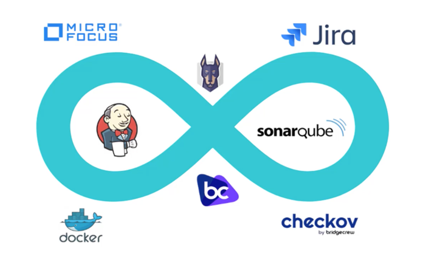
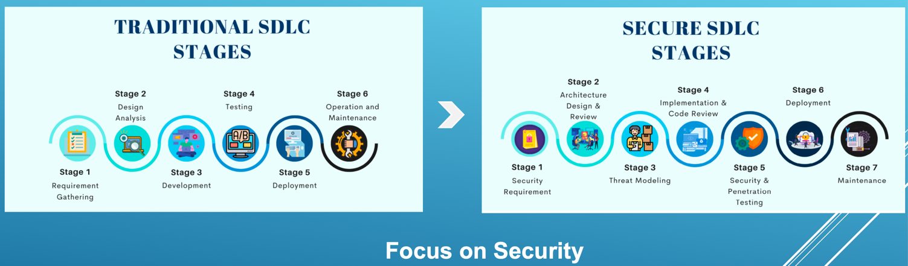

# Agenda: 
- Course Introduction
- DevSecOps and DevOps
- Role and Responsibilities of DevSecOps Engineer
- SAST and its Tools 
- SAST Demo 
- SBOM & SCA and its tools
- IAC and its tools
- Container Security Demo
- Container Security and its tools
- DAST Demo
- DAST and its tools
- SCA Demo
- IAC Demo
- CWE & CVE & CVSS
- What is FPA?
- FPA Demo
- Report security vulns in JIRA
- DevSecOps Maturity Model
- Two IDE Plugins Demo
- Basics of IDE Plugins
- Git Demo
- SAST scan using Docker Demo
- Docker Basics
- Basics of CI/CD tools
- Install  CI/CD tool – Jenkins
- Implement End to End DevSecOps Pipeline using Jenkins
- How to find a security Job in market?

## INTRODUCTION TO DEVSECOPS
1. What is DevSecOps? 
    - DevSecOps stands for Development, Security, and Operations. It's an approach that integrates security practices directly into the DevOps process. The main idea is to incorporate security from the beginning of the development lifecycle, rather than treating it as an afterthought or a separate phase.

    - In a traditional DevOps model, developers and operations teams work closely together to automate, integrate, and deliver software at a rapid pace. However, DevOps doesn't always emphasize security, leaving it to be handled separately, often late in the development cycle.
### Key Points about DevSecOps:
-   Security as Code: Security becomes an integral part of the entire software development lifecycle (SDLC), from planning to deployment, ensuring that security issues are identified and mitigated early.

-   Automation of Security: Security tools are often automated and integrated into the CI/CD (Continuous Integration/Continuous Delivery) pipeline, ensuring that security checks are performed automatically during development and before deployment.

-   Collaboration: Developers, security professionals, and operations teams work together to ensure that security measures are embedded within the development process.

-   Shift-left: Security is "shifted left," meaning it's introduced early in the process, not just during deployment or after development.

## How DevSecOps is Different from DevOps:
**Focus on Security:**
-   DevOps focuses primarily on development and operations, aiming to streamline the software delivery process, improve collaboration, and automate testing, integration, and deployment. DevSecOps, on the other hand, explicitly includes security at every phase of this process.

**Security Integration:**
-   In DevOps, security might be a separate step, handled by a security team after development or before deployment. In DevSecOps, security is a shared responsibility among developers, security specialists, and operations teams from day one.

**Automation of Security:**
-   DevSecOps ensures that security is automated within the CI/CD pipeline, applying security checks, tests, and validations as part of every deployment. In DevOps, security checks might happen later in the cycle or during post-deployment reviews.

**Faster Response to Threats:**
-   DevSecOps provides a proactive approach to security by addressing vulnerabilities early, while DevOps may lead to security risks being discovered later in the cycle.

### In Summary:
**DevOps:** Focused on improving collaboration and speed between development and operations teams, but security may be a secondary concern.

**DevSecOps:** Builds security into the DevOps lifecycle, ensuring that security is continuously managed, tested, and automated as part of the development and deployment processes.

## Roles and Responsibilities of DevSecOps Engineer:-
-  Perform Static Application Security Testing (SAST) using IDE plugins, such as SonarLint.

-  Implement credential scanning tools, like GitGuardian, in the CI/CD pipeline or at the commit level, e.g., GIT Secrets.

-  Integrate SAST tools, such as SonarQube, SonarCloud, Fortify Source Code Analysis, Veracode, and Checkmarx, into the CI/CD pipeline.

-  Integrate Software Composition Analysis (SCA) tools, like OWASP Dependency Check, Snyk, and Black Duck, into the CI/CD pipeline.

-  Integrate Dynamic Application Security Testing (DAST) tools, such as OWASP ZAP, WebInspect, Veracode DAST, and Burp Suite, into the CI/CD pipeline.

-  Integrate container scanning tools, like Trivy and AQUA, into the CI/CD pipeline.

-  Integrate Infrastructure as Code (IaC) scanning tools, like Snyk and Bridgecrew, into the CI/CD pipeline.

-  Perform SAST, SCA, and DAST security scans and conduct false positive analysis on security vulnerabilities.

-  Report security vulnerabilities in a ticketing tool, like JIRA, and assign tickets to the development team to fix these vulnerabilities.

-  Write scripts in YAML and other scripting languages to integrate security tools into the CI/CD pipelines. This is also known as the Shift Left approach.

-  Improve the DevSecOps maturity level of overall development processes.

-  Implement cloud security controls and recommendations for compliance.
