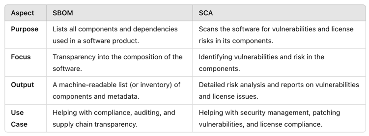
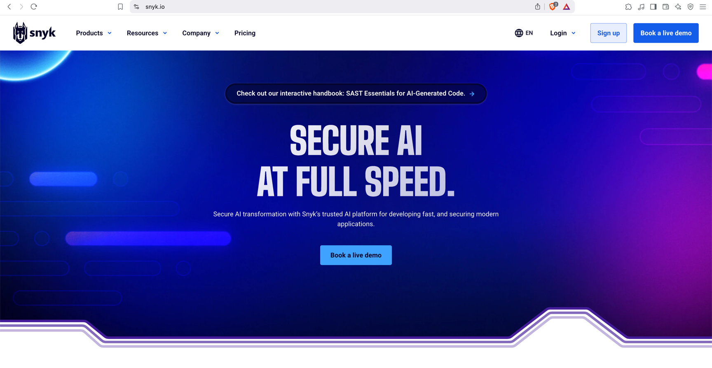
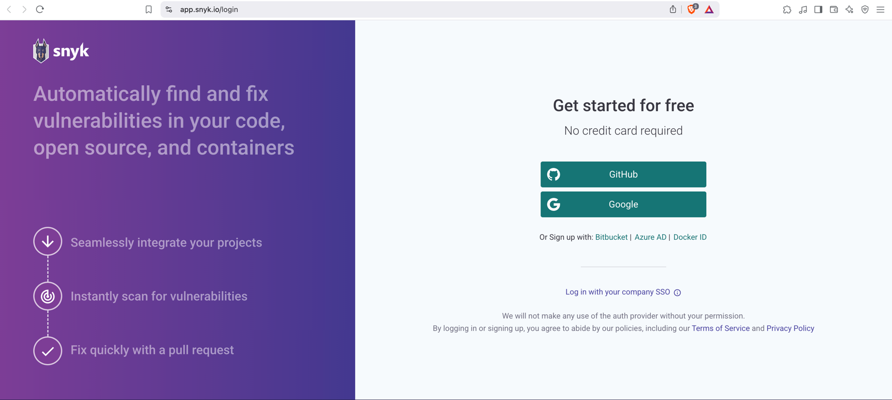
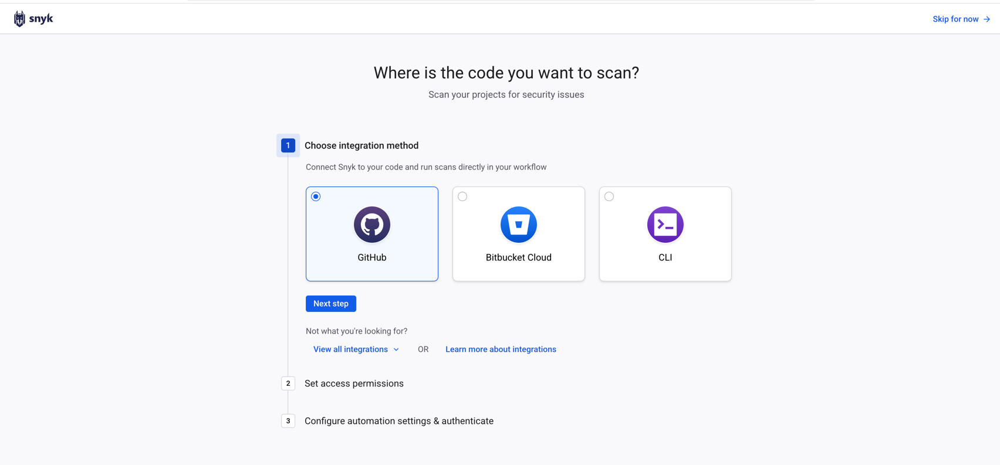
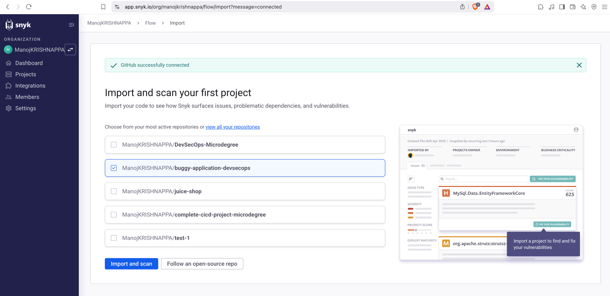
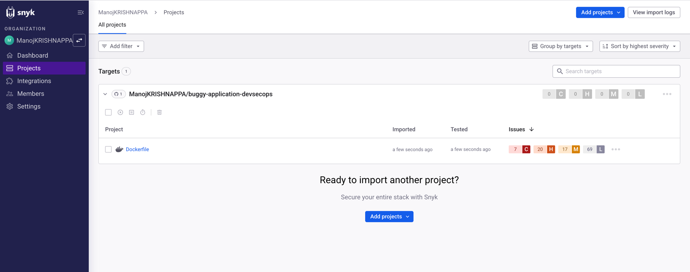
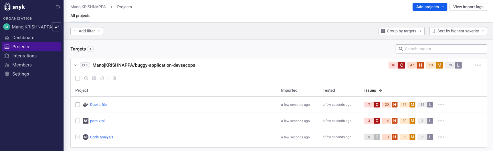
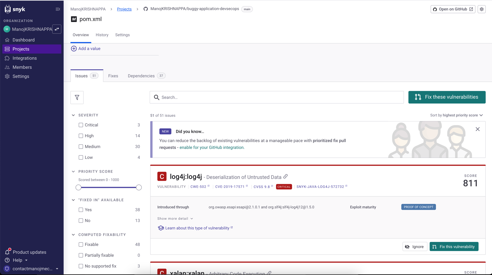

# Software Bill of Materials (SBOM) and Software Composition Analysis (SCA)
**Software Bill of Materials (SBOM)** is a comprehensive, machine-readable list or inventory of all the components, libraries, and dependencies that are used in a software product. An SBOM includes detailed metadata about each component, such as its version, licensing information, and any known vulnerabilities associated with it. The primary goal of an SBOM is to provide transparency into the components that make up software, helping organizations identify potential security vulnerabilities, licensing issues, or compatibility concerns. 

**SBOM stands for "Software Bill of Materials"** is a list of all the software components and their versions
that are included in a particular software application or system. The SBOM includes both the first-party
components that were developed by the software vendor and the third-party components that were used
to build the application. The purpose of an SBOM is to provide a complete and accurate inventory of all
the components that make up a software application or system. SBOMs are an important part of
software composition analysis (SCA) and are increasingly being used in the software development and
maintenance process to ensure the security and compliance of applications.

### The key features of an SBOM include:

-   A complete list of all third-party components and dependencies.

-   Information about versions, license types, and known security vulnerabilities of components.

-   Transparency for better risk management in supply chains.

**Software Composition Analysis (SCA)**, on the other hand, is the practice of scanning software codebases for open-source and third-party components, identifying known vulnerabilities, licensing issues, and other risks. It typically goes beyond just creating an SBOM by automatically scanning the software for specific vulnerabilities, outdated libraries, and license conflicts. The SCA tools identify issues in the software components and dependencies and provide risk assessments based on up-to-date vulnerability databases (such as CVEs) and other factors.

**Software Composition Analysis(SCA)** scan is a process of identifying and analyzing the third-party
libraries, frameworks, and other components that are used in a software application. The goal of SCA is
to identify potential security vulnerabilities, licensing issues, and other risks associated with the use of
third-party components in an application.

## Note: 
-   SBOM handles the first party and third party libraries where as SCA handles only third party
and Here SBOM is input for SCA

## The key differences between SBOM and SCA are:

### Commercial SCA Tools:
#### Black Duck (by Synopsys)
Black Duck is a widely-used commercial tool that helps organizations manage open-source security, compliance, and code quality. It scans codebases for known vulnerabilities and provides comprehensive reports on open-source risks.

#### Snyk
Snyk is a developer-first security tool designed to identify and fix vulnerabilities in open-source code, containers, and infrastructure as code. Snyk integrates with CI/CD pipelines and IDEs.

#### WhiteSource
WhiteSource offers real-time open-source security and license compliance management. It helps identify vulnerabilities, generate SBOMs, and ensure compliance with licensing policies.

#### Veracode
Veracode provides a range of security scanning tools, including Software Composition Analysis, that helps identify vulnerabilities in open-source and third-party components.

#### Sonatype Nexus Lifecycle
Nexus Lifecycle helps organizations manage their open-source components, detecting vulnerabilities and enforcing security policies in the software development lifecycle.

### Open-Source SCA Tools:
#### OWASP Dependency-Check
A widely used open-source tool that identifies known vulnerabilities in dependencies used by a project. It integrates well with build tools and CI/CD pipelines.

#### OSS Index
OSS Index is a free service that offers vulnerability information about open-source components. It provides APIs for automated scanning and integrates with other tools like Jenkins or GitHub.

#### FOSSA (also offers commercial solutions)
FOSSA is an open-source and commercial tool for license compliance and security vulnerability scanning. It helps in managing open-source licenses and identifying vulnerabilities in code dependencies.

#### Retire.js
Retire.js is an open-source tool for detecting JavaScript libraries with known vulnerabilities. It is commonly used for web application security.

#### CycloneDX
CycloneDX is an open-source software bill of materials (SBOM) standard that also helps with software composition analysis. It integrates with other tools to provide transparency on open-source vulnerabilities.

#### Dependabot
Dependabot, now owned by GitHub, is an open-source tool that automatically creates pull requests to update dependencies and fix known vulnerabilities in a project.

## Summary:
SBOM focuses on providing a detailed inventory of software components for transparency and risk management.

SCA scans for vulnerabilities, license compliance, and other risks associated with third-party components in a software project.

Commercial tools like Black Duck, Snyk, and Veracode offer enterprise-grade solutions for SCA, while open-source tools like OWASP Dependency-Check, Retire.js, and OSS Index provide free options for managing software composition risks.

# SCA DEMO WITH SNYK
Repo for practice: https://github.com/ManojKRISHNAPPA/buggy-application-devsecops.git

https://snyk.io/

Login Via Github:

SCA tool looks for third party here look for POM.xml

