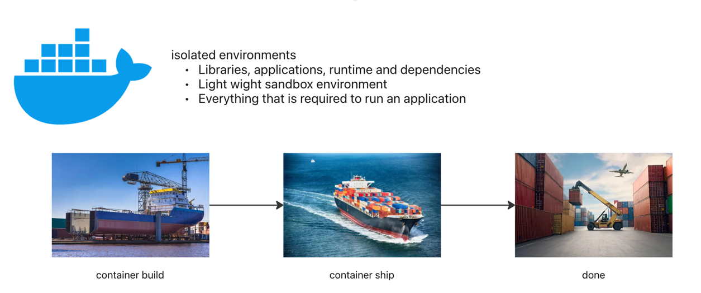
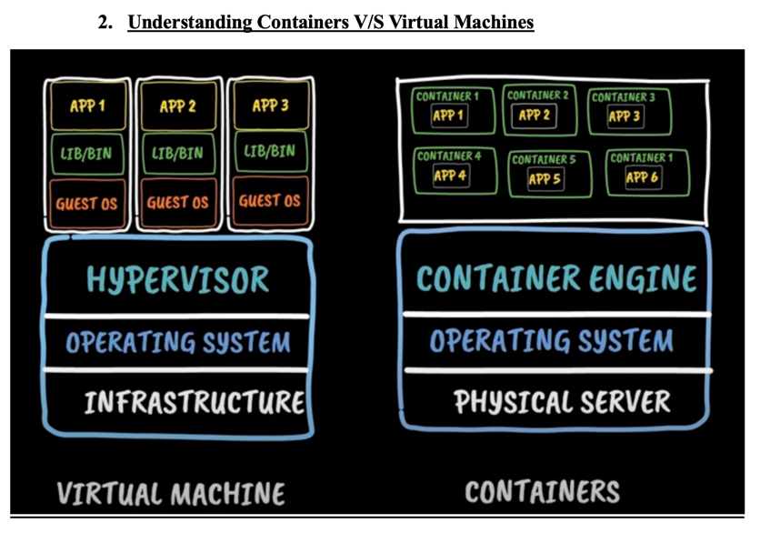
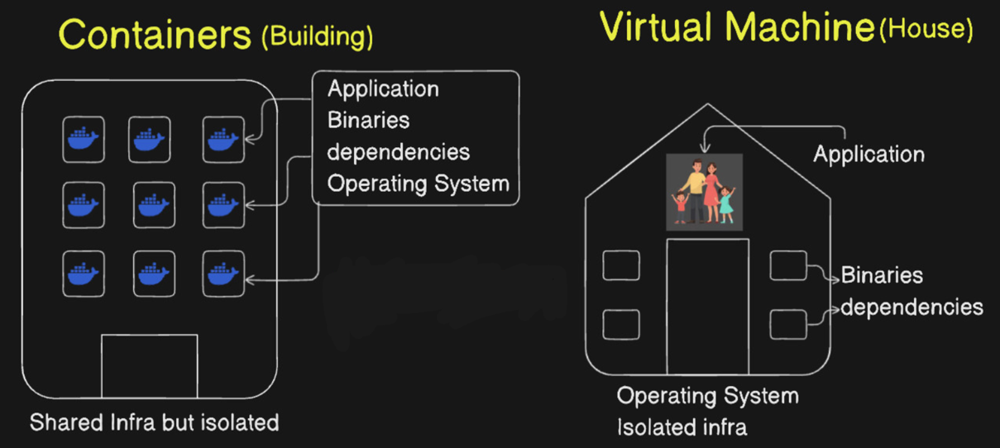
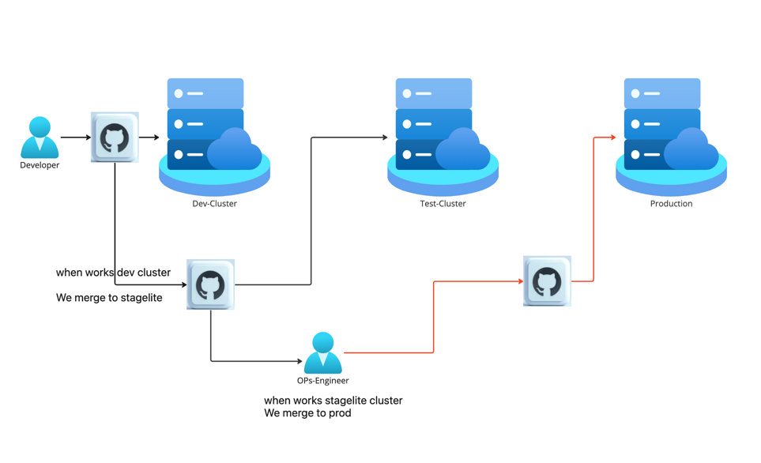
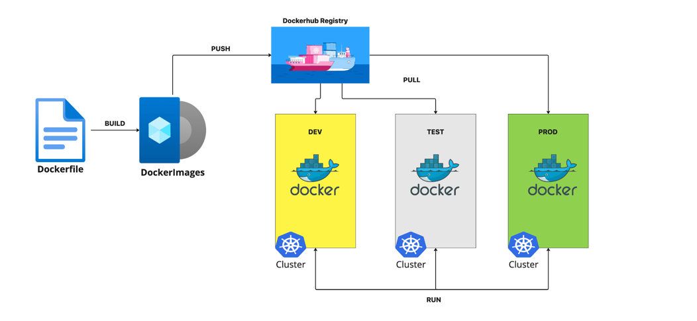

# CONTAINER SECURITY AND ITS TOOLS

## Basics of docker:
### 1.	What is Docker..?
Docker is a software platform that allows you to build, test, and deploy applications quickly. Docker packages software into standardized units called containers that have everything the software needs to run including libraries, system tools, code, and runtime. Using Docker, you can quickly deploy and scale applications into any environment and know your code will run.



### Containers V/S Virtual machines with the help of a Building and House analogy

### Workflow:


### DOCKER WORKFLOW


### How To Dockerize a Project

**Sample git repo:** https://github.com/ManojKRISHNAPPA/React-app-to-do.git
```yaml
FROM node:18-alpine
WORKDIR /app
COPY . .
RUN yarn install --production
CMD ["node", "src/index.js"]
EXPOSE 3000
```
•	Build the docker image using the application code and Dockerfile
``` 
docker build -t todo .
```
•	Verify the image has been created and stored locally using the below command:
```
docker images
```
•	Create a public repository on hub.docker.com and push the image to remote repo
```
docker login
```
```commandline
docker tag todo:latest username/new-reponame:tagname
```
```yaml
docker push username/new-reponame:tagname
```
•	To pull the image to another environment , you can use below command
```commandline
docker pull username/new-reponame:tagname
```
•	To start the docker container, use below command
```commandline
docker run -dp 3000:3000 username/new-reponame:tagname
```
•	Verify your app. If you have followed the above steps correctly, your app should be listening on localhost:3000
•	To enter(exec) into the container, use the below command
```commandline
docker exec -it containername sh
or
docker exec -it containerid sh
```
•	To view docker logs
```commandline
docker logs containername
docker logs containerid
```


## CONTAINER SECURITY AND ITS TOOLS

### Container Security Scan
1. **Container Security Scan** refers to the process of identifying vulnerabilities, misconfigurations, and security risks within containerized applications and their associated environments. Containers, such as those using Docker or Kubernetes, allow developers to package applications and their dependencies into isolated environments for portability and scalability. However, containers also introduce new security challenges, such as:

2. **Vulnerabilities in base images:** Containers often rely on base images (e.g., Ubuntu, Alpine), which may contain outdated or vulnerable libraries or packages.

3. **Misconfigurations:** Incorrect configurations can expose containers to attacks, such as excessive privileges or improper network access.

4. **Dependency management:** Containers may use multiple dependencies or third-party components, and vulnerabilities in these can be exploited.

5. **Runtime security:** The security of running containers needs to be monitored, particularly in a dynamic, distributed environment like Kubernetes.

6. Container security scanning aims to address these issues by analyzing the container image, configuration files, runtime behavior, and overall environment for security flaws, including:

7. **Vulnerabilities:** Identifying known security issues in the container images, libraries, and dependencies (e.g., CVEs).

8. **Configuration errors:** Checking for incorrect configurations that might expose containers to risk, such as insecure network settings or improper resource allocation.

9. **Runtime security:** Ensuring that the container behaves securely during execution, including checking for privilege escalation or unauthorized access.

10. **Compliance:** Ensuring that containerized applications comply with relevant standards and regulations (e.g., GDPR, PCI-DSS).

### Commercial and Open-Source Tools for Container Security Scan
There are both commercial and open-source tools available to perform container security scans. These tools can analyze container images, orchestrator configurations (such as Kubernetes), and monitor containers during runtime.

**Commercial Container Security Tools:**
#### Aqua Security

Description: Aqua Security provides comprehensive security solutions for containers, Kubernetes, and cloud-native applications. Aqua's security platform includes vulnerability scanning, configuration checks, and runtime protection.

Features: Image scanning, runtime protection, compliance checks, network segmentation, and support for multiple orchestrators (e.g., Kubernetes, Docker).

Website: Aqua Security

#### Twistlock (by Palo Alto Networks)

Description: Twistlock is a container security platform that provides vulnerability scanning, access control, and compliance management for containerized applications.

Features: Real-time vulnerability scanning, network security, container runtime protection, and compliance with standards like HIPAA, GDPR, etc.

Website: Twistlock

#### Anchore

Description: Anchore provides container security and compliance scanning solutions that focus on detecting vulnerabilities and compliance issues within container images.

Features: Image scanning, policy enforcement, CVE management, and compliance with Docker and Kubernetes environments.

Website: Anchore

#### Qualys Container Security

Description: Qualys offers container security scanning as part of its broader security platform. It provides visibility into container vulnerabilities and compliance issues throughout the software lifecycle.

Features: Image scanning, container runtime security, continuous monitoring, and integration with CI/CD pipelines.

Website: Qualys Container Security

#### Sysdig Secure

Description: Sysdig Secure provides container security with image scanning, runtime protection, and monitoring capabilities for Kubernetes and Docker environments.

Features: Vulnerability scanning, network monitoring, runtime security, threat detection, and compliance auditing.

Website: Sysdig Secure

#### Snyk Container

Description: Snyk Container offers vulnerability scanning for containers, focusing on detecting known vulnerabilities in container images, code, and dependencies.

Features: Continuous scanning, detailed vulnerability reports, integration with CI/CD pipelines, and automated patching.

Website: Snyk Container

### Open-Source Container Security Tools:
#### Clair

Description: Clair is an open-source project from CoreOS (now part of Red Hat) that provides container vulnerability scanning for Docker and other container images.

Features: Vulnerability scanning for known CVEs, integration with CI/CD pipelines, and real-time updates.

Website: Clair

#### Trivy

Description: Trivy is a simple and fast open-source vulnerability scanner for containers, which detects vulnerabilities in container images, file systems, and Git repositories.

Features: Vulnerability scanning, support for Docker images and Kubernetes, and detection of misconfigurations.

Website: Trivy

#### Docker Bench for Security

Description: Docker Bench for Security is an open-source tool that checks for security best practices in Docker containers and configurations. It performs audits based on Docker’s security recommendations.

Features: Checks for secure Docker configurations, including host, container, and network settings, as well as best practices for containers in a production environment.

Website: Docker Bench for Security

#### Kube-bench

Description: Kube-bench is an open-source tool that checks whether Kubernetes clusters comply with the CIS (Center for Internet Security) Kubernetes Benchmark, ensuring proper security configurations.

Features: Kubernetes-specific security audits, checks for common security misconfigurations, and integration with CI/CD pipelines.

Website: Kube-bench

#### Falco

Description: Falco is an open-source container runtime security tool that focuses on detecting anomalous activity at runtime within Kubernetes or Docker containers.

Features: Real-time security monitoring, detection of unexpected behavior, integration with Kubernetes, and automatic alerting on suspicious activities.

Website: Falco

#### Grype

Description: Grype is an open-source vulnerability scanner for container images, designed to identify vulnerabilities in software dependencies. It integrates with other container security tools like Trivy and Clair.

Features: Scans container images, reports vulnerabilities with CVE IDs, and integrates with CI/CD pipelines for continuous security.

Website: Grype

#### Anchore Engine

Description: Anchore Engine is an open-source tool that provides vulnerability scanning and policy enforcement for container images.

Features: Scanning for vulnerabilities, policy-based security checks, and integration with container registries and CI/CD systems.

Website: Anchore Engine

#### Summary:
Container Security Scans are essential for detecting vulnerabilities, misconfigurations, and risks in containerized applications and environments. These scans can be performed on container images, the configurations of container orchestrators (like Kubernetes), and during the runtime of the containers themselves.

Commercial Tools such as Aqua Security, Twistlock, Anchore, and Qualys offer comprehensive security features, including vulnerability scanning, runtime protection, and compliance management.

Open-Source Tools such as Clair, Trivy, Falco, and Kube-bench offer free solutions for scanning container images, auditing Kubernetes configurations, and monitoring runtime behavior.

Both commercial and open-source tools are crucial for securing containerized environments throughout the development lifecycle, from building images to runtime monitoring.

## Hands On: Container Security scan using Snyk

### Install Snyk CLI on Ubuntu
The Snyk CLI is a tool that helps you test your applications, including Docker containers, for vulnerabilities.

**Step 1: Install Node.js and npm (if not already installed)**
Snyk CLI requires Node.js and npm (Node Package Manager). Install them if you don't have them installed yet.

```commandline
sudo apt update
sudo apt install -y nodejs npm
```
Verify the installtion:
```commandline
node -v
npm -v
```
**Step 2: Install Snyk CLI globally using npm**
```commandline
sudo npm install -g snyk
```
**Step 3: Verify Installation**
```commandline
snyk --version
```
# 2. Test a Docker Container Using Snyk CLI
**Step 1: Authenticate with Snyk**
```commandline
snyk auth
```
**Step 2: Test Docker Image for Vulnerabilities**
```commandline
snyk test --docker myapp:latest
```

**Option 2: Test an Image from Docker Hub**
You can also test an image from a public registry like Docker Hub. For example, to test the official nginx image:
```commandline
snyk test --docker nginx
```
**Step 3: Monitor the Image**
To continuously monitor the image for new vulnerabilities, use the monitor command:
```commandline
snyk monitor --docker myapp:latest
```
