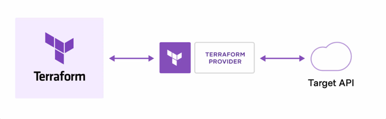
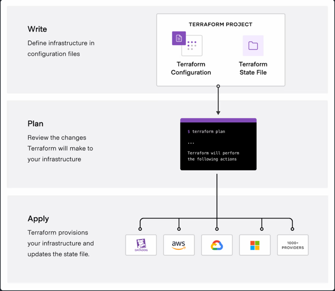
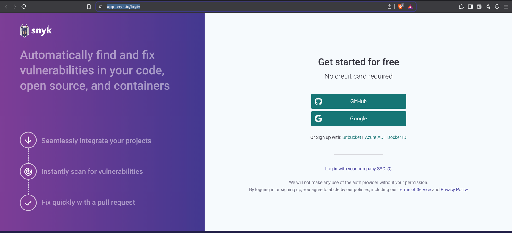
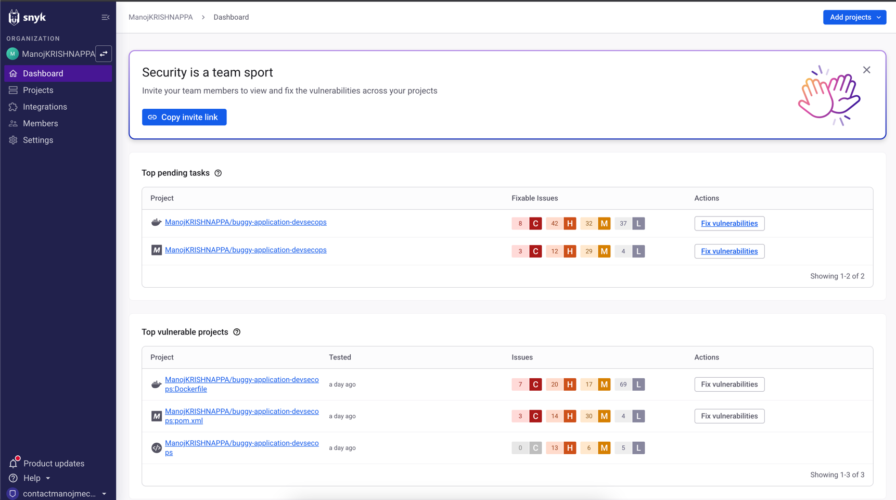
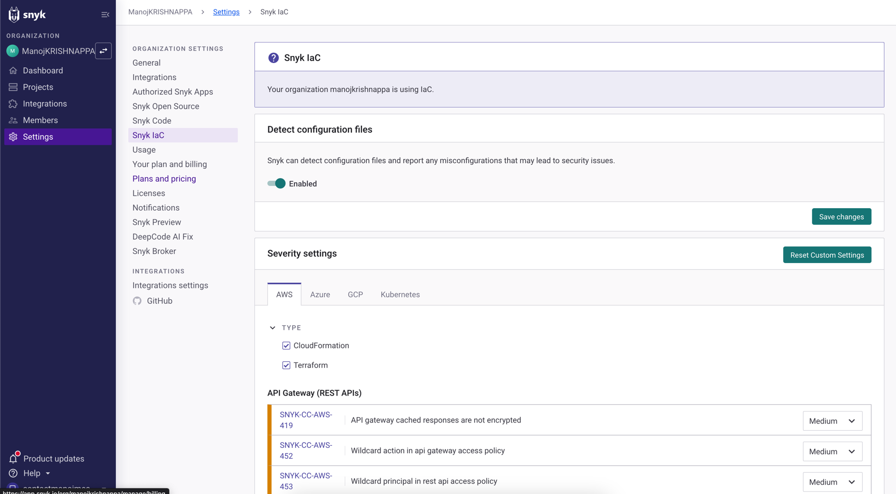
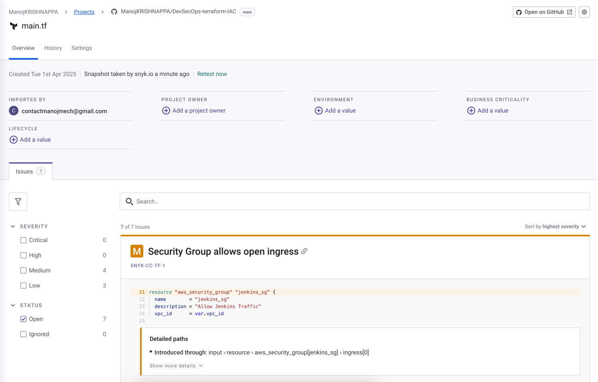

# Basics of IAC:
### What is Terraform?
Terraform is an infrastructure as code tool that lets you build, change, and version infrastructure safely and efficiently. This includes low-level components like compute instances, storage, and networking; and high-level components like DNS entries and SaaS features.

### How does Terraform work?
Terraform creates and manages resources on cloud platforms and other services through their application programming interfaces (APIs). Providers enable Terraform to work with virtually any platform or service with an accessible API.


HashiCorp and the Terraform community have already written thousands of providers to manage many different types of resources and services. You can find all publicly available providers on the Terraform Registry, including Amazon Web Services (AWS), Azure, Google Cloud Platform (GCP), Kubernetes, Helm, GitHub, Splunk, DataDog, and many more.

### The core Terraform workflow consists of three stages:
-   **Write:** You define resources, which may be across multiple cloud providers and services. For example, you might create a configuration to deploy an application on virtual machines in a Virtual Private Cloud (VPC) network with security groups and a load balancer.
-   **Plan:** Terraform creates an execution plan describing the infrastructure it will create, update, or destroy based on the existing infrastructure and your configuration.
-   **Apply:** On approval, Terraform performs the proposed operations in the correct order, respecting any resource dependencies. For example, if you update the properties of a VPC and change the number of virtual machines in that VPC, Terraform will recreate the VPC before scaling the virtual machines.



### Terraform Use Cases

#### 1. Multi-Cloud Infrastructure Management
Use Case: Provisioning and managing infrastructure across multiple cloud providers (e.g., AWS, Azure, Google Cloud) simultaneously.

Example: A company wants to deploy an application with compute instances in AWS, a database in Google Cloud, and storage in Azure. With Terraform, you can write configurations to manage all these resources across different clouds in a unified way.

Benefit: Simplifies multi-cloud management, reduces complexity by using a single tool, and enables consistency across different cloud environments.

#### 2. Infrastructure Automation
Use Case: Automating the deployment, management, and scaling of infrastructure resources.

Example: Automatically provisioning virtual machines, networks, and storage for development, staging, and production environments in AWS.

Benefit: Saves time, reduces errors, and ensures repeatable, consistent infrastructure provisioning.

#### 3. Scaling Infrastructure with Ease
Use Case: Dynamically adjusting infrastructure based on demand, such as scaling virtual machines or auto-scaling groups in cloud environments.

Example: Automatically scaling the number of EC2 instances in AWS depending on the traffic load or usage patterns of an application.

Benefit: Ensures optimal resource usage, cost-efficiency, and performance by adjusting infrastructure based on real-time demands.

#### 4. Disaster Recovery & High Availability
Use Case: Creating multi-region, multi-availability zone architectures to ensure high availability and failover capabilities.

Example: Using Terraform to set up an application across multiple availability zones in AWS (or regions in GCP) to ensure that it remains available in case of failures.

Benefit: Improves reliability and uptime by automatically provisioning disaster recovery setups in the infrastructure.

#### 5. Version Control for Infrastructure
Use Case: Storing infrastructure configurations in version control systems (like Git) to manage changes over time.

Example: A team of developers can version control Terraform configurations and collaborate on infrastructure changes, just like code. This provides an auditable history of infrastructure changes.

Benefit: Enhances collaboration, change tracking, and rollback capabilities, reducing configuration drift and manual errors.

#### 6. Self-Healing Infrastructure
Use Case: Automatically repairing and recovering infrastructure when failures occur.

Example: If a virtual machine fails, Terraform can detect the failure and automatically recreate the resource with the correct configuration.

Benefit: Reduces downtime and increases the reliability of the infrastructure by automatically detecting and fixing issues.

#### 7. Consistent Environment Management
Use Case: Ensuring that environments (development, staging, production) are identical, eliminating configuration drift.

Example: Using Terraform to create identical infrastructure for development and production, ensuring no discrepancies between environments.

Benefit: Promotes consistent and reproducible environments, which improves testing, deployment, and overall developer productivity.

#### 8. Cost Optimization and Budget Management
Use Case: Ensuring that infrastructure resources are provisioned according to cost constraints and are properly sized.

Example: Using Terraform to deploy an infrastructure environment, monitor resource usage, and modify resources (e.g., reducing the size of instances or turning off unused resources) to reduce costs.

Benefit: Helps manage cloud resources effectively, optimizing costs and avoiding over-provisioning.

#### 9. Security and Compliance Automation
Use Case: Enforcing security policies and compliance requirements through infrastructure configurations.

Example: Using Terraform to deploy resources like Virtual Private Networks (VPNs), security groups, firewalls, IAM roles, etc., that adhere to organizational security guidelines.

Benefit: Ensures that security best practices are followed and makes it easier to implement regulatory compliance measures (e.g., PCI-DSS, GDPR).

#### 10. Hybrid Infrastructure Management
Use Case: Managing infrastructure that spans both on-premises and cloud environments.

Example: Using Terraform to provision and manage resources like servers, storage, and networking in a private data center alongside cloud services like AWS or Azure.

Benefit: Simplifies hybrid cloud infrastructure management, enabling a unified workflow between on-premises and cloud environments.

#### 11. Infrastructure Testing and Validation
Use Case: Validating infrastructure changes before applying them to production using testing tools like terraform plan or terraform validate.

Example: Running tests to validate Terraform configurations and ensure that no unwanted changes are introduced before applying changes to the live environment.

Benefit: Helps catch errors early, minimizing the risk of breaking changes and making deployments more predictable and safer.

#### 12. Platform as a Service (PaaS) Configuration
Use Case: Configuring and managing infrastructure for Platform as a Service (PaaS) offerings like Kubernetes clusters or managed services.

Example: Using Terraform to manage Kubernetes clusters (EKS, AKS, GKE) or setting up platforms like Heroku or AWS Elastic Beanstalk.

Benefit: Ensures that the configurations for platform services are reproducible, versioned, and manageable in a consistent way.

#### 13. Continuous Integration and Continuous Deployment (CI/CD) Pipelines
Use Case: Integrating Terraform into CI/CD pipelines to automatically apply infrastructure changes as part of application deployment.

Example: Integrating Terraform with tools like Jenkins, GitLab CI, or GitHub Actions to apply infrastructure changes whenever there are changes in the configuration files.

Benefit: Automates infrastructure provisioning as part of the deployment process, promoting DevOps practices and improving collaboration between development and operations teams.

#### 14. Provisioning Serverless Architectures
Use Case: Managing and deploying serverless infrastructure (e.g., AWS Lambda, Google Cloud Functions) with Terraform.

Example: Using Terraform to provision and configure serverless functions, API Gateway, and DynamoDB tables for a serverless web application.

Benefit: Simplifies the management of serverless resources and ensures that infrastructure provisioning is repeatable and version-controlled.

## What is IAC (Infrastructure As Code) scan?
1.  Infrastructure as Code (IAC) refers to the practice of using code to define and manage infrastructure
resources such as servers, networking components, and other IT resources. IAC allows organizations to
automate the provisioning, configuration, and management of their infrastructure, which can improve
efficiency and reduce the risk of errors.
2. An IAC security scan is a process of analyzing IAC code and configurations to identify potential security
vulnerabilities or misconfigurations. This can be done manually or using automated tools that are
designed to scan IAC code for known vulnerabilities or patterns that may indicate potential security
issues.
3. Commercial IAC Security tools are Checkov, Snyk, CloudSploit. These tools can be integrated in
CI/CD platforms.
4. Free or Open source DAST tools are Snyk Community Edition

## IAC SECURITY DEMO WITH Checkov
Checkov is a popular open-source static code analysis tool for scanning Terraform, CloudFormation, Kubernetes, and other IaC files for security and compliance issues.

### Step 1: Install Checkov on Ubuntu
1. Install pip (if it's not already installed):
```
sudo apt update
sudo apt install python3-pip
```
2. Install Checkov using pip:
```commandline
pip3 install checkov
```
### Step 2: Verify Checkov Installation
```commandline
checkov --version
```

### Step 3: Create a Sample Terraform File

```commandline
mkdir ~/checkov-demo
cd ~/checkov-demo
```
Then, create a simple main.tf file with the following content:
```commandline
provider "aws" {
  region = "us-east-1"
}

resource "aws_s3_bucket" "my_bucket" {
  bucket = "my-demo-bucket"

  # Misconfiguration: setting a public bucket policy
  acl = "public-read"
}
```
### Step 4: Run Checkov to Scan the Terraform File
```commandline
checkov -d .
```

**Explanation of the command:**

**-d .** specifies the directory to scan. In this case, we're scanning the current directory (.).

Checkov will analyze the main.tf file and output any security issues it finds.

### Step 5: Review the Results
```commandline
Checkov run started with 1 check(s)...
    Failed checks:
    - Checkov 2.0.0
    - Found issues in file 'main.tf': ['CKV_AWS_22: S3 bucket has public read ACL']

    - CKV_AWS_22: S3 bucket has public read ACL
      file: /home/ubuntu/checkov-demo/main.tf:8
      severity: HIGH
      description: "The S3 bucket should not have public-read ACL"
      recommended_action: "Remove public-read ACL from the bucket to avoid public exposure."
      
Checkov run finished with results:
    Failed: 1
    Passed: 0
    Skipped: 0
    Total: 1
```

### Step 6: Fix the Security Issue
```commandline
resource "aws_s3_bucket" "my_bucket" {
  bucket = "my-demo-bucket"
  
  # Secure the bucket by removing the public-read ACL
  acl = "private"
}
```

### Step 7: Re-run Checkov
```commandline
checkov -d .
```

#### If everything is fixed, you should see something like:
```commandline
Checkov run started with 1 check(s)...
Checkov run finished with results:
    Failed: 0
    Passed: 1
    Skipped: 0
    Total: 1
```
## Additional Checkov Commands
Scan specific file: If you want to scan just one file instead of a directory, specify the file directly:
```commandline
checkov -f main.tf
```
Generate an output in a specific format (JSON, HTML): To generate output in a specific format like JSON or HTML:
```commandline
checkov -d . --output json > checkov_report.json
```

### Hands On: IAC Security Scanning Demo using Snyk IAC (SaaS Model)

https://app.snyk.io/login



## Detect configuration should be enabled:




