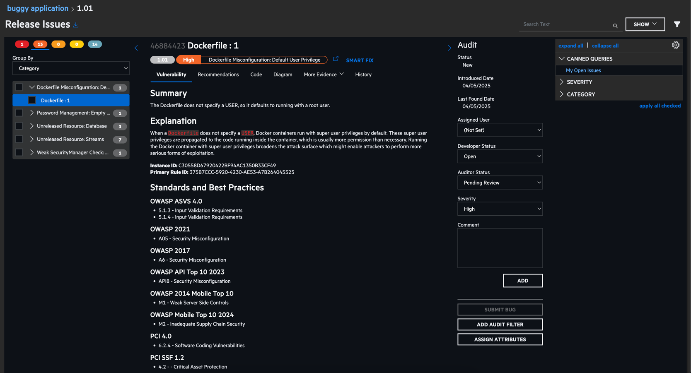
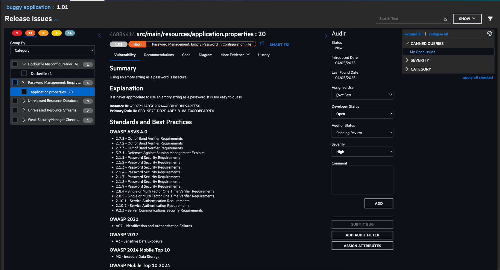
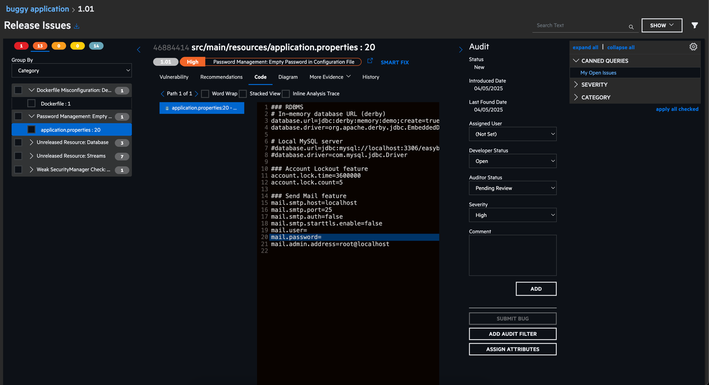
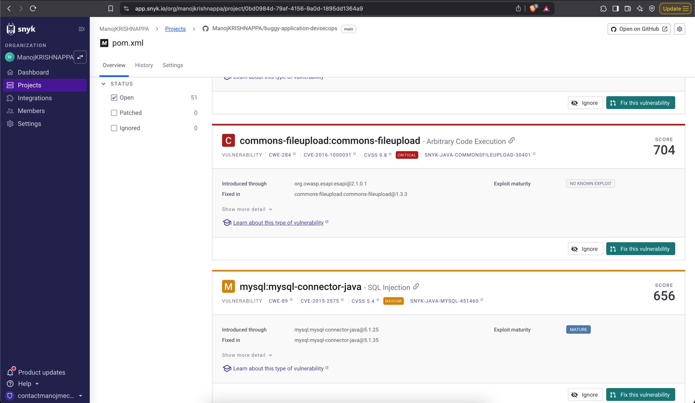
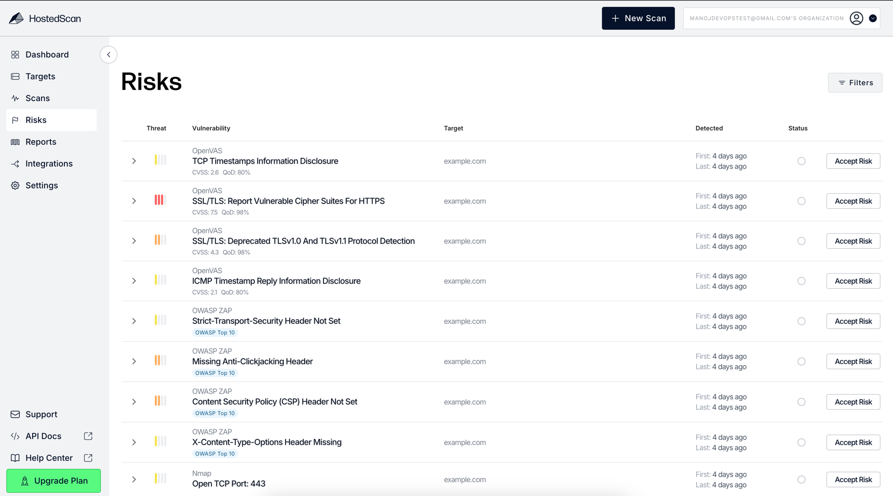
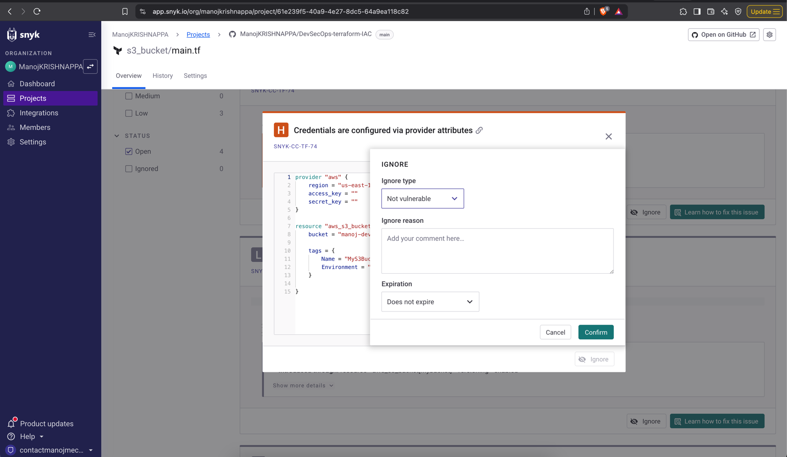

# FALSE POSITIVE ANALYSIS (FPA)
-   False positive analysis is the process of identifying and analyzing false positives in a system or
process. A false positive, also known as a "false alarm," is an error that occurs when a system or
process wrongly identifies something as a threat or problem when it is not.

- In the context of cybersecurity, false positives refer to instances where a security system or
process wrongly identifies a code as being vulnerable. For example, If SonarQube says that CSRF
token is not implemented in the system but the token is implemented with some other name would
lead to False Positive event generated by SonarQube security tool.

- False positives can be a problem because they can waste resources, cause unnecessary
disruptions, and lead to a lack of trust in the system or process. They can also lead to "alert
fatigue," where users become desensitized to alerts and may ignore them even when a real threat
is present.

- This involves improving the accuracy of the system by marking the incorrect security vulnerabilities
in the system as False and then generating the report only with True Positives.

## FALSE POSITIVE DEMO FOR SAST, SCA, DAST, IAC & CONTAINER SECURITY 
https://trial.fortify.com/Releases/244623/Scans
### 1. Using fortify we can define 

Here user shoudl be defined and its true postive

### 2. Password Guidance

Username and password should not be mentioned in the properties file

### 3. By Using snyk
We can fix this commons-fileupload:commons-fileupload critical issue by upgrading the version

### 4. By using dynamic testing in hosted scan:
https://hostedscan.com/risks

### 5. IAC scanning: https://app.snyk.io/org/manojkrishnappa/project/61e239f5-40a9-4e27-8dc5-64a9ea118c82

