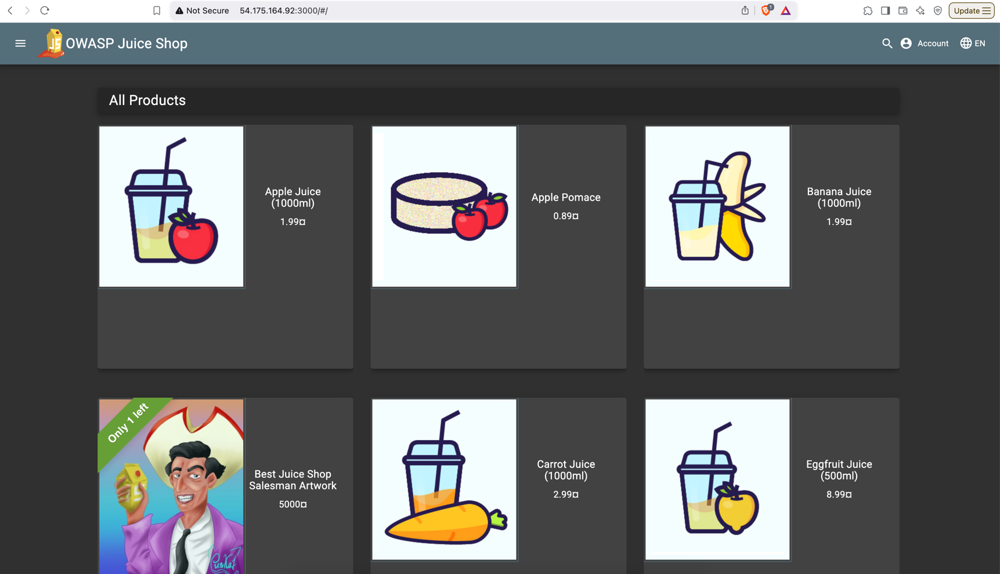

git repo to install juice-shop via local: https://github.com/ManojKRISHNAPPA/juice-shop

Or directly use image:
## install docker on ubuntu server:
```commandline
#!/bin/bash
sudo apt-get update -y

# Install Docker
sudo apt-get install docker.io -y
sudo usermod -aG docker ubuntu
newgrp docker
sudo chmod 660 /var/run/docker.sock
sudo chown root:docker /var/run/docker.sock
sudo systemctl restart docker
docker -version
```

## pull the docker image
```commandline
docker pull bkimminich/juice-shop
```
## Create the container:
```commandline
docker run -it -d -p 3000:3000 bkimminich/juice-shop
```



