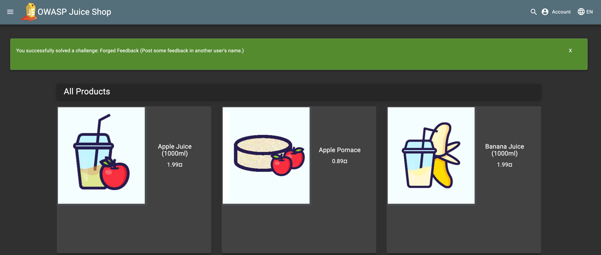
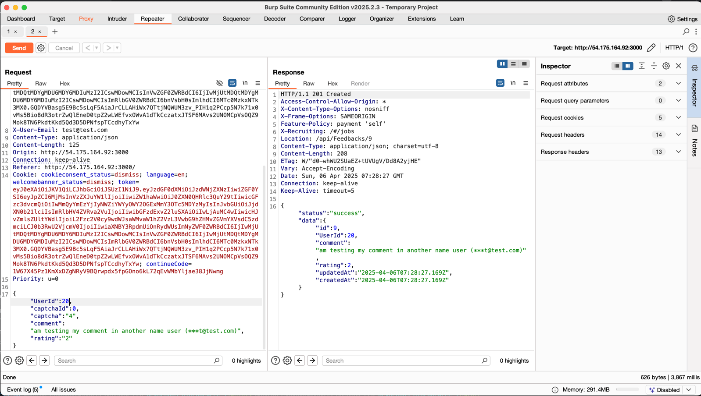

# A01: Broken Access Control  
-   Access control is used to enforce the policy such that users cannot act outside of their intended permission boundaries
-   if the access control brakes, it leads to unauthersied information disclouser, modification or destrcution of all the data

https://help.owasp-juice.shop/part2/cryptographic-issues.html

# Some realtime examples:

## 1. Facebook’s Private Photo Leak (2019)
-   **Vulnerability:** A flaw in Facebook's access control system allowed attackers to access private photos from users' accounts, even those that were intended to be private.
-   **How it Happened:** The bug allowed an attacker to view private photos by modifying the URL parameter that referenced the photo ID. The application didn't properly verify if the user requesting the photo actually had permission to view it.
-   **Impact:** Users' private photos could be accessed by unauthorized users, leading to significant privacy concerns.
-   **Resolution:** Facebook fixed the bug by ensuring that all photo requests were properly validated on the server side, and only the legitimate users could access their own photos.

## 2. Twitter's Access Control Flaw (2020)
-   **Vulnerability:** A flaw in Twitter’s access control allowed unauthorized users to delete tweets or send direct messages on behalf of other users.

-   **How it Happened:** The vulnerability allowed attackers to manipulate certain parameters (like tweet IDs or message parameters) to interact with resources owned by other users. In some cases, attackers could delete tweets that weren’t theirs or send DMs to other users.

-   **Impact:** Attackers could perform actions on behalf of others without proper authorization, leading to unauthorized changes to users' accounts.

-   **Resolution:** Twitter fixed this issue by validating access control on the server side to ensure that actions were only allowed for the appropriate user.

## 3. GitHub’s Private Repository Access (2018)
-   **Vulnerability:** A GitHub bug allowed unauthorized users to access private repositories.

-   **How it Happened:** GitHub’s internal access control system was misconfigured, and attackers could guess or modify URLs to access private repositories they weren't authorized to view. The issue was particularly with how GitHub handled repository URL structure, which led to unintended exposure of private repositories.

-   **Impact:** Unauthorized access to private code and repositories, which could contain sensitive data, business logic, or intellectual property.

-   **Resolution:** GitHub fixed the issue by enforcing stricter access control checks and ensuring that only authorized users could access specific repositories, even if the URL was guessed or modified.

## 4. Amazon's AWS S3 Bucket Data Breach (2017)
-   **Vulnerability:** Misconfigured Amazon S3 buckets led to sensitive data exposure.

-   **How it Happened:** Many companies failed to set proper access control policies on their S3 storage, making the data publicly accessible. Attackers could easily discover and download data from these unprotected storage buckets, exposing sensitive information like passwords, personal details, and credit card numbers.

-   **Impact:** Sensitive data, including personally identifiable information (PII), was exposed to the public due to improper access control configurations.

-   **Resolution:** Amazon AWS improved default security settings and urged users to implement proper access control policies (such as requiring access keys and restricting public access to S3 buckets).

## 5. Uber’s Data Breach (2016)
-   **Vulnerability:** Broken access control was responsible for a data breach at Uber, which affected 57 million users and drivers.

-   **How it Happened:** The attackers gained unauthorized access to Uber’s system by exploiting an AWS API key that was exposed in a public GitHub repository. The key was not properly restricted by Uber’s access control mechanisms.

-   **Impact:** Sensitive data, including names, email addresses, and phone numbers of 57 million Uber users and drivers, were exposed. Additionally, the attackers were able to steal sensitive information from Uber’s internal systems.

-   **Resolution:** Uber responded by ensuring more stringent access control policies and better management of secret keys. They also disclosed the breach after some time.

### 6. Microsoft's Azure Blob Storage Misconfiguration (2019)
-   **Vulnerability:** A misconfiguration in Microsoft Azure’s access control led to the exposure of sensitive data.

-   **How it Happened:** A bug in Azure’s access control configuration allowed attackers to access data in Azure Blob storage containers that should have been private. Many organizations left their storage publicly accessible without enforcing proper access control policies.

-   **Impact:** Data such as social security numbers, passport information, and other sensitive files were exposed to anyone who discovered the unprotected containers.

-   **Resolution:** Microsoft Azure improved access control policies and provided better default settings to ensure that users didn't expose their data to the public by mistake.

### 7. WordPress Plugin Vulnerability
-   **Vulnerability:** A popular WordPress plugin suffered from broken access control, which allowed unauthorized users to access private posts.

-   **How it Happened:** The plugin failed to properly authenticate users before they accessed certain pages. By modifying a URL parameter, unauthorized users could gain access to private content that was meant to be visible only to specific users or groups.

-   **Impact:** Sensitive content, including private posts and data, was exposed to users who shouldn’t have had access to it.

-   **Resolution:** The plugin was updated to enforce proper access control checks for sensitive pages, ensuring only authorized users could access private content.

### 8. Instagram Account Access Bug (2021)
**Vulnerability:** An Instagram bug allowed unauthorized users to change another user’s profile picture.

**How it Happened:** Attackers could access and modify the profile pictures of other users without proper authorization. Instagram’s access control was improperly configured, allowing users to access another user's account settings.

**Impact:** Attackers could alter user accounts, leading to impersonation, confusion, and privacy violations.

**Resolution:** Instagram fixed the bug by improving its access control checks on the server side, preventing unauthorized users from making changes to another user’s profile.

### 9. Whatsapp view once feature:

## Key Takeaways: 
1. Access Control Failures: Broken access control can allow unauthorized users to view, modify, or delete data they shouldn't have access to. This can lead to data leaks, privacy violations, and potential system compromise.

2. Misconfiguration: Many of these examples were caused by misconfigurations or flaws in how access control was implemented, either through weak validation of parameters, exposed API keys, or improperly set permissions.

3. Mitigation: To prevent such vulnerabilities, it's crucial to:

-   Implement and test Role-Based Access Control (RBAC).

-   Always validate user input and ensure server-side checks for permissions.

-   Regularly audit and monitor access control configurations.

-   Use tools like automated vulnerability scanners to identify broken access control issues.

# HANdS on with our Jucie shop application:
https://owasp.org/Top10/en/A01_2021-Broken_Access_Control/

## Broken Access Control prevention steps:
-   Except for public resource deny by default
-   Implement access control mechanism once and re-use them throughout the application, Including the CROS usage
-   Disable the we server directory listing
-   Rate Limit the API and controller access to minimize the harm from automated attach tooling 

Hands on:
Giving the customer feedback by another person name:

