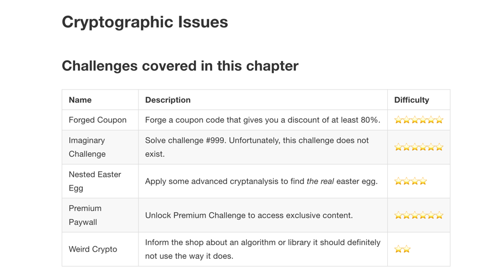

Shifting up one position to #2, previously known as Sensitive Data Exposure, which is more of a broad symptom rather than a root cause, the focus is on failures related to 
cryptography (or lack thereof). Which often lead to exposure of sensitive data. Notable Common Weakness Enumerations (CWEs) included are CWE-259: Use of Hard-coded Password, CWE-327: Broken or Risky Crypto Algorithm, and CWE-331 Insufficient Entropy.

https://help.owasp-juice.shop/part2/cryptographic-issues.html

base64 as encryption but we shall only use encoding mechanism
