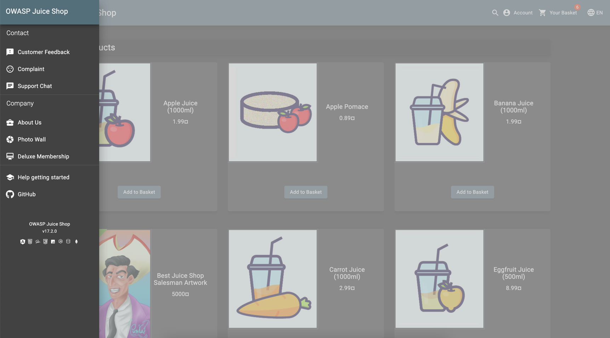
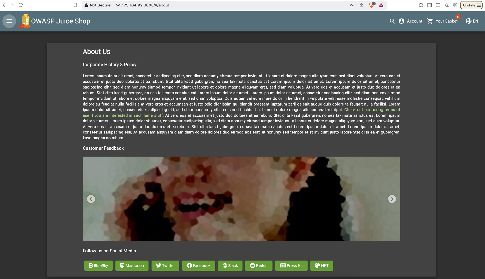
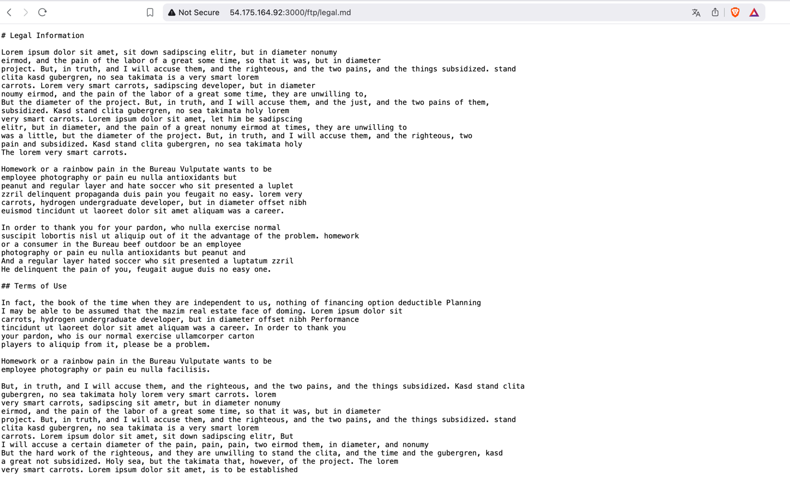
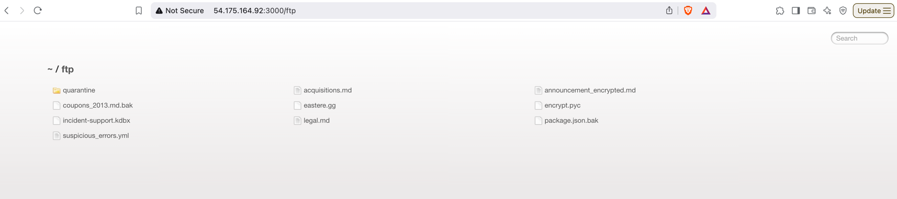

# Overview
A new category for 2021 focuses on risks related to design and architectural flaws, with a call for more use of threat modeling, secure design patterns, and reference architectures. As a community we need to move beyond "shift-left" in the coding space to pre-code activities that are critical for the principles of Secure by Design. Notable Common Weakness Enumerations (CWEs) include CWE-209: Generation of Error Message Containing Sensitive Information, CWE-256: Unprotected Storage of Credentials, CWE-501: Trust Boundary Violation, and CWE-522: Insufficiently Protected Credentials.

# Description
Insecure design is a broad category representing different weaknesses, expressed as “missing or ineffective control design.” Insecure design is not the source for all other Top 10 risk categories. There is a difference between insecure design and insecure implementation. We differentiate between design flaws and implementation defects for a reason, they have different root causes and remediation. A secure design can still have implementation defects leading to vulnerabilities that may be exploited. An insecure design cannot be fixed by a perfect implementation as by definition, needed security controls were never created to defend against specific attacks. One of the factors that contribute to insecure design is the lack of business risk profiling inherent in the software or system being developed, and thus the failure to determine what level of security design is required.

## If we remove the legal.md we can access other file location as well

Without permission we should not access that so we can access confidentails doc in website

### Prevention steps:

1. A secure development lifecycle (SDLC) with appspec professionals to help evaluate and desgin secuirty controls
2. perform threat monitoring in early stages of sdlc
3. create security user stories and implement it along with development user stories
4. write unit and integration tests
5. Limit resource consumption by user or service

