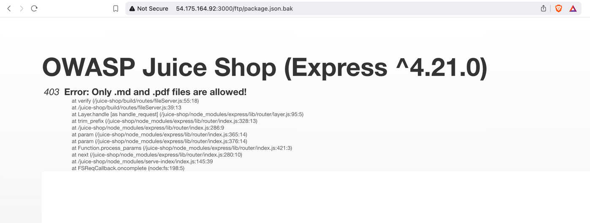

# A06:2021 – Vulnerable and Outdated Components
It was #2 from the Top 10 community survey but also had enough data to make the Top 10 via data. Vulnerable Components are a known issue that we struggle to test and assess risk and is the only category to not have any Common Vulnerability and Exposures (CVEs) mapped to the included CWEs, so a default exploits/impact weight of 5.0 is used. Notable CWEs included are CWE-1104: Use of Unmaintained Third-Party Components and the two CWEs from Top 10 2013 and 2017.

## Description
## You are likely vulnerable:

-   If you do not know the versions of all components you use (both client-side and server-side). This includes components you directly use as well as nested dependencies.

-   If the software is vulnerable, unsupported, or out of date. This includes the OS, web/application server, database management system (DBMS), applications, APIs and all components, runtime environments, and libraries.

-   If you do not scan for vulnerabilities regularly and subscribe to security bulletins related to the components you use.

-   If you do not fix or upgrade the underlying platform, frameworks, and dependencies in a risk-based, timely fashion. This commonly happens in environments when patching is a monthly or quarterly task under change control, leaving organizations open to days or months of unnecessary exposure to fixed vulnerabilities.

-   If software developers do not test the compatibility of updated, upgraded, or patched libraries.

-   If you do not secure the components’ configurations (see A05:2021-Security Misconfiguration).

## How to Prevent
### There should be a patch management process in place to:

- Remove unused dependencies, unnecessary features, components, files, and documentation.

- Continuously inventory the versions of both client-side and server-side components (e.g., frameworks, libraries) and their dependencies using tools like versions, OWASP Dependency Check, retire.js, etc. Continuously monitor sources like Common Vulnerability and Exposures (CVE) and National Vulnerability Database (NVD) for vulnerabilities in the components. Use software composition analysis tools to automate the process. Subscribe to email alerts for security vulnerabilities related to components you use.

- Only obtain components from official sources over secure links. Prefer signed packages to reduce the chance of including a modified, malicious component (See A08:2021-Software and Data Integrity Failures).

- Monitor for libraries and components that are unmaintained or do not create security patches for older versions. If patching is not possible, consider deploying a virtual patch to monitor, detect, or protect against the discovered issue.

- Every organization must ensure an ongoing plan for monitoring, triaging, and applying updates or configuration changes for the lifetime of the application or portfolio.


So here not able to see the packages so now we will do null bite injection



```commandline
%2500.md
```

With this we can download the file


```commandline
{
  "name": "juice-shop",
  "version": "6.2.0-SNAPSHOT",
  "description": "An intentionally insecure JavaScript Web Application",
  "homepage": "http://owasp-juice.shop",
  "author": "Björn Kimminich <bjoern.kimminich@owasp.org> (https://kimminich.de)",
  "contributors": [
    "Björn Kimminich",
    "Jannik Hollenbach",
    "Aashish683",
    "greenkeeper[bot]",
    "MarcRler",
    "agrawalarpit14",
    "Scar26",
    "CaptainFreak",
    "Supratik Das",
    "JuiceShopBot",
    "the-pro",
    "Ziyang Li",
    "aaryan10",
    "m4l1c3",
    "Timo Pagel",
    "..."
  ],
  "private": true,
  "keywords": [
    "web security",
    "web application security",
    "webappsec",
    "owasp",
    "pentest",
    "pentesting",
    "security",
    "vulnerable",
    "vulnerability",
    "broken",
    "bodgeit"
  ],
  "dependencies": {
    "body-parser": "~1.18",
    "colors": "~1.1",
    "config": "~1.28",
    "cookie-parser": "~1.4",
    "cors": "~2.8",
    "dottie": "~2.0",
    "epilogue-js": "~0.7",
    "errorhandler": "~1.5",
    "express": "~4.16",
    "express-jwt": "0.1.3",
    "fs-extra": "~4.0",
    "glob": "~5.0",
    "grunt": "~1.0",
    "grunt-angular-templates": "~1.1",
    "grunt-contrib-clean": "~1.1",
    "grunt-contrib-compress": "~1.4",
    "grunt-contrib-concat": "~1.0",
    "grunt-contrib-uglify": "~3.2",
    "hashids": "~1.1",
    "helmet": "~3.9",
    "html-entities": "~1.2",
    "jasmine": "^2.8.0",
    "js-yaml": "3.10",
    "jsonwebtoken": "~8",
    "jssha": "~2.3",
    "libxmljs": "~0.18",
    "marsdb": "~0.6",
    "morgan": "~1.9",
    "multer": "~1.3",
    "pdfkit": "~0.8",
    "replace": "~0.3",
    "request": "~2",
    "sanitize-html": "1.4.2",
    "sequelize": "~4",
    "serve-favicon": "~2.4",
    "serve-index": "~1.9",
    "socket.io": "~2.0",
    "sqlite3": "~3.1.13",
    "z85": "~0.0"
  },
  "devDependencies": {
    "chai": "~4",
    "codeclimate-test-reporter": "~0.5",
    "cross-spawn": "~5.1",
    "eslint": "~4.7",
    "eslint-scope": "3.7.2",
    "form-data": "~2.3",
    "frisby": "~2.0",
    "grunt-cli": "~1.2",
    "http-server": "~0.10",
    "jasmine-reporters": "~2.2",
    "jest": "~22",
    "karma": "~1.7",
    "karma-chrome-launcher": "~2.2",
    "karma-cli": "~1.0",
    "karma-coverage": "~1.1",
    "karma-jasmine": "~1.1",
    "karma-junit-reporter": "~1.2",
    "karma-phantomjs-launcher": "~1.0",
    "karma-safari-launcher": "~1.0",
    "lcov-result-merger": "~1.2",
    "mocha": "~4",
    "nyc": "~11",
    "phantomjs-prebuilt": "~2",
    "protractor": "~5",
    "shelljs": "~0.7",
    "sinon": "~4",
    "sinon-chai": "~2.14",
    "socket.io-client": "~2.0",
    "standard": "~10",
    "stryker": "~0",
    "stryker-api": "~0",
    "stryker-html-reporter": "~0",
    "stryker-jasmine": "~0",
    "stryker-karma-runner": "~0",
    "stryker-mocha-runner": "~0"
  },
  "repository": {
    "type": "git",
    "url": "https://github.com/bkimminich/juice-shop.git"
  },
  "bugs": {
    "url": "https://github.com/bkimminich/juice-shop/issues"
  },
  "license": "MIT",
  "scripts": {
    "postinstall": "npm --prefix ./app install ./app && grunt minify",
    "start": "node app",
    "test": "standard && karma start karma.conf.js && nyc --report-dir=./build/reports/coverage/server-tests mocha test/server",
    "frisby": "nyc --report-dir=./build/reports/coverage/api-tests node ./test/apiTests.js",
    "preupdate-webdriver": "npm install",
    "update-webdriver": "webdriver-manager update",
    "preprotractor": "npm run update-webdriver",
    "protractor": "node test/e2eTests.js",
    "stryker": "stryker run stryker.client-conf.js",
    "vagrant": "cd vagrant && vagrant up"
  },
  "engines": {
    "node": ">=6 <=9"
  },
  "standard": {
    "ignore": [
      "/app/private/**",
      "/vagrant/**"
    ],
    "env": {
      "jasmine": true,
      "node": true,
      "browser": true,
      "mocha": true,
      "protractor": true
    },
    "globals": [
      "angular",
      "inject"
    ]
  },
  "nyc": {
    "include": [
      "lib/*.js",
      "routes/*.js"
    ],
    "all": true,
    "reporter": [
      "lcov",
      "text-summary"
    ]
  },
  "jest": {
    "testMatch": [
      "**/test/api/*Spec.js"
    ],
    "testPathIgnorePatterns": [
      "/node_modules/",
      "/app/node_modules/"
    ]
  }
}
```


Now we can scan all the dependency
https://security.snyk.io/


Final step is report this valnaraibitly
